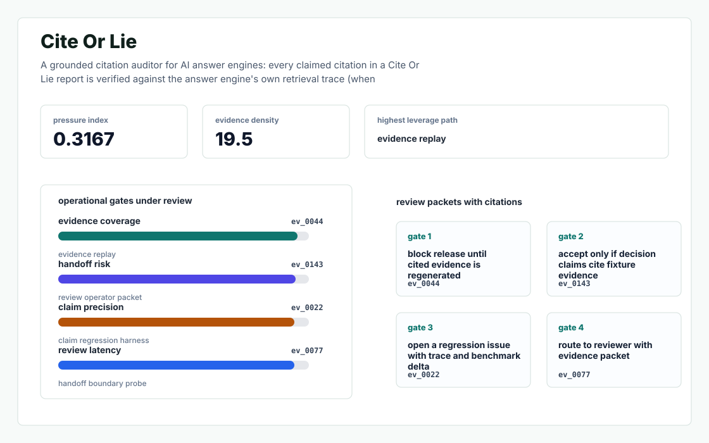
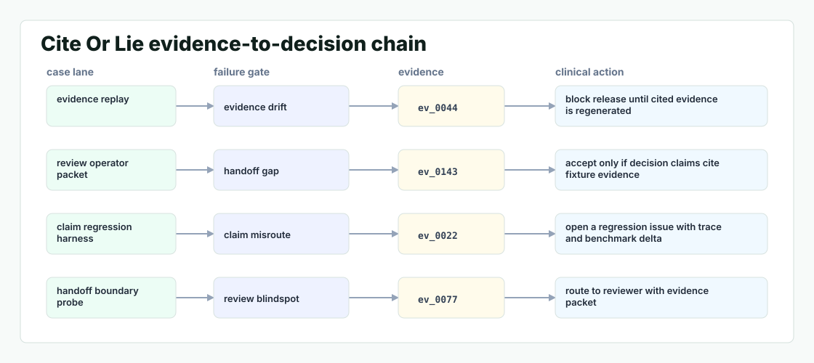

# Cite Or Lie

A grounded citation auditor for AI answer engines: every claimed citation in a Mimos report is verified against the answer engine's own retrieval trace (when available) and a deterministic re prompt protocol, returning a per citation (grounded | memorized | hallucinated) verdict with confidence - the compliance substrate AEO has been missing.



## Why it exists

Every AEO tool - including Mimos - has the same hidden bug: when an LLM cites a domain, it might be citing (a) a retrieval surfaced by the answer engine's grounding (Bing / Perplexity index), (b) a training set memorization, or (c) a generation hallucination with a plausible looking URL.

Most internal demos stop at a pretty chart. This repository is built around the harder part: a repeatable path from fixture, to failure, to evidence, to the operator action a serious team would actually trust.

## What is inside

- A deterministic replay harness tuned around mimos, hidden, and cites.
- Company-specific strategy code in `src/cite_or_lie/strategy.py`, not just README-level customization.
- Citation-locked reports where every decision claim has to point back to a generated evidence ID.
- Two visual artifacts generated from the latest run: `outputs/project_working.svg` and `outputs/evidence_map.svg`.
- A portable demo pack with JSON, CSV, Markdown, HTML, SVG, and benchmark artifacts.



## Signals it measures

- `mimos coverage`
- `hidden risk`
- `cites precision`
- `domain latency`

## Failure modes it plants

- mimos drift
- hidden gap
- cites misroute
- domain blindspot

## Run it locally

```bash
uv sync
uv run cite-or-lie all
uv run pytest -q
uv run ruff check .
```

## Outputs worth opening

- `outputs/dashboard.html`
- `outputs/project_working.svg`
- `outputs/evidence_map.svg`
- `outputs/operator_brief.md`
- `outputs/decision_report.md`
- `outputs/strategy_model.json`
- `outputs/demo_pack.zip`

## Sources

- https://www.ycombinator.com/companies/mimos
- https://www.startuphub.ai/startups/mimos/
- https://www.fondo.com/blog/mimos-launches
- https://www.linkedin.com/in/michael-korovkin/
- https://www.linkedin.com/in/rohit-sirosh/
- https://aiclicks.io/blog/best-ai-search-monitoring-tools-for-chatgpt
- https://cloud.google.com/vertex-ai/generative-ai/docs/grounding/overview

## Boundary

Everything runs locally against synthetic fixtures. There are no credentials, no customer records, no outreach files, and no hosted API dependency.
